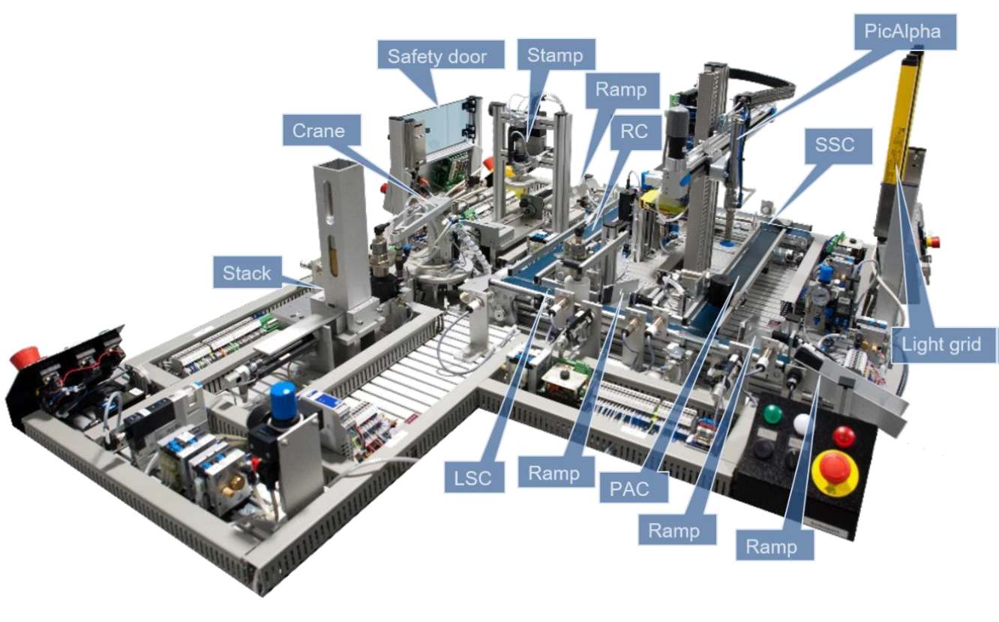

# xPPU-Frost

A digital twin implementation of the Extended Pick&Place Unit (xPPU) using the [Frost](https://github.com/glacier-project/frost) framework and [Lingua Franca](https://www.lf-lang.org/).



## Overview

This repository contains a virtual platform for simulating and testing the xPPU, a Cyber-Physical Production System (CPPS) used as a benchmark in Industry 4.0 research. The implementation leverages the Frost framework to provide:

- **Deterministic execution** of the xPPU control logic
- **Digital Twin capabilities** for virtual testing and validation
- **Modular architecture** with reusable components (Stack, Crane, Stamp, Conveyor)
- **Data model-driven interface** for flexible machine configuration
- **Kafka integration** for real-time data streaming

## xPPU Components

The xPPU consists of the following main modules:

| Component      | Description                                                    |
| -------------- | -------------------------------------------------------------- |
| **Stack**      | Workpiece storage and dispensing unit with monostable cylinder |
| **Crane**      | Rotary crane for workpiece transport with pneumatic gripper    |
| **Stamp**      | Stamping station for workpiece processing                      |
| **LSConveyor** | Linear sorting conveyor with position sensors                  |

More details about each component can be found in the `src/` directory.

## Prerequisites

- Python 3.12 or higher
- [Lingua Franca](https://www.lf-lang.org/) compiler (`lfc`)
- CMake (for building)
- Docker (optional, for containerized deployment)

## Getting Started

### 1. Clone the repository

```bash
git clone --recursive https://github.com/glacier-project/xppu-frost.git
cd xppu-frost
```

### 2. Install dependencies

```bash
python3 -m venv .venv
source .venv/bin/activate
python3 -m pip install -r requirements.txt
```

## Project Structure

```
xppu-frost/
├── src/
│   ├── Main.lf                 # Main reactor entry point
│   ├── XPPU.lf                 # xPPU composite reactor
│   ├── common/                 # Shared components (MonostableCylinder, etc.)
│   ├── stack/                  # Stack module
│   ├── crane/                  # Crane module
│   ├── stamp/                  # Stamp module
│   ├── conveyor/               # Conveyor module
│   └── python-lib/             # Python utilities
├── example/
│   ├── simple_demo/            # Simple demo with Kafka integration
├── test/                       # Test suite
│   ├── src/                    # Test reactors
│   └── resources/              # Test configurations
├── resources/
│   ├── frost_config.yml        # Frost configuration
│   └── data_model/             # Data model definitions
├── frost/                      # Frost framework (submodule)
├── Dockerfile                  # Base Docker image
└── docker-bake.hcl             # Docker Bake configuration
```

## Running Examples

### Simple Demo (with Kafka)

The simple demo showcases the xPPU with Kafka integration for data streaming:

```bash
cd example/simple_demo

# Install dependencies
python -m pip install -r requirements.txt

# Start Kafka (using Docker Compose)
docker compose up -d kafka

# Build and run the demo
lfc src/Main.lf
./bin/Main -f false  # -f false for real-time execution
```

To run entirely in Docker:

```bash
# Build all images
docker buildx bake

# Run the demo
cd example/simple_demo
docker compose up
```

## Running Tests

```bash
cd test

# Run all tests
make all

# Run a specific test
make test-TestStack
```

## Configuration

### Frost Configuration

The `resources/frost_config.yml` file configures reactor parameters and logging:

```yaml
time_precision: MSECS # Milliseconds precision in the logs
logging_level: INFO # Global logging level
reactors:
  xppu:
    logging_level: DEBUG # Override logging level for xPPU reactor
    parameters:
      data_model_path: "resources/data_model/xppu.yml"
```

### Data Model

The xPPU data model is defined in YAML files under [`resources/data_model/`](resources/data_model/xppu.yml). It specifies:

- Variables (state, sensors, actuators)
- Methods (commands, operations)
- Hierarchical folder structure

## Docker Support

### Building Images

Using Docker Bake:

```bash
# Build all images
docker buildx bake

# Build specific target
docker buildx bake base
docker buildx bake simple_demo
```

### Running in Docker

```bash
docker run --rm xppu-frost-demo:latest
```

## Documentation

- [Lingua Franca Documentation](https://www.lf-lang.org/docs)
- [Frost Framework](https://github.com/esd-univr/frost)
- [Machine Data Model](https://github.com/esd-univr/machine-data-model)
- [Glacier Project](https://github.com/esd-univr/glacier)
- [xPPU](https://www.mec.ed.tum.de/ais/forschung/demonstratoren/ppu/)

## Contributing

Contributions are welcome! Please follow the [contribution guidelines](.github/copilot-instructions.md) for coding style and commit conventions.

## License

See [LICENSE](LICENSE) file for details.
